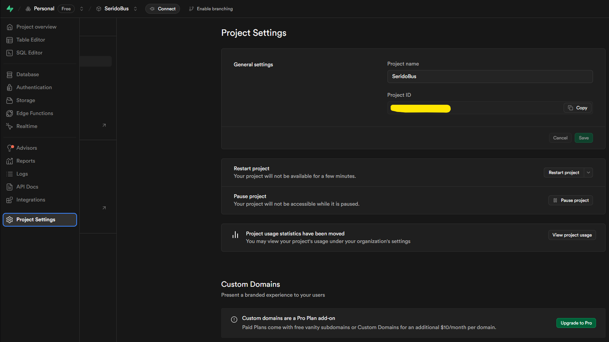

# SeridoBus

Sistema de listagem de estudantes que farão uso de ônibus escolar.

## Como rodar?

Após clonar o projeto, será necessário criar uma conta no supabase. 

Depois de criar conta e projeto, copie o arquivo ```.env.example``` com o nome de ```.env```.

Com o arquivo ```.env``` criado, no dashboard do supabase, procure: 

```Project Settings > Data API > Project URL > URL```

Como na imagem mostrada abaixo, clique na aba Project Settings:



E copie a URL:


e aplique a ```SUPABASE_URL``` no ```.env```.

Em seguida, copie, também, a API Key para o ```.env``` em ```SUPABASE_ANON_KEY```:

Dentro do dashboard do Supabase, busque por ```Project Settings > API Keys > API Keys```. Como abaixo:


Em seguida, baixe todas a dependências:

```bash
    npm install
```

Por fim, rode o projeto:

```bash 
    npm start
```
